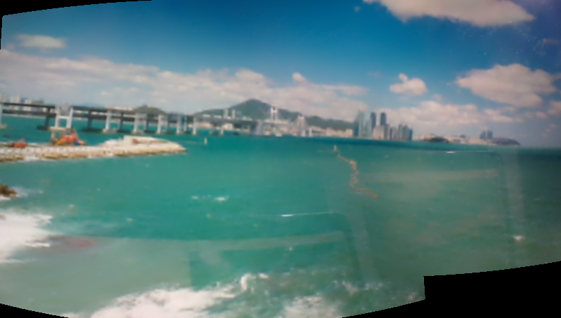

<div align="center">

<!-- logo -->


### 낙서를 그림으로 🖍️

[]() []() []()
<br/> []()

</div>

## 🤖 앱 실행법

- https://drive.google.com/file/d/1Ch3Kjr7dFXuijePSj0NkpHgf64lGAt1-/view?usp=sharing

- 앱 설치 후 실행까지 기기 성능에 따라 최대 20초 정도 걸릴 수 있습니다.

## 📝 소개

실시간으로 웹 카메라로 다양한 이펙트와 파라노마 기능 즉 서로 다른 이미지를 자연스럽게 붙여주는 기능을 가지고 있습니다.
추가적으로 낙서도 작품으로 만들어주는 서비스입니다.

- 프로젝트 소개
- 프로젝트 화면 구성
- 사용한 기술 스택
- 기술적 이슈와 해결 과정
- 프로젝트 팀원

<br />

### 화면 구성

|                추가기능                |
| :------------------------------------: |
|  |
|     화면에 대한 설명을 입력합니다.     |

| 기존 6.6 특수효과와 6.5 파라노마 효과를 합해서 실시간으로 필터가 적용된 파라노마 기능으로 서로 다른 이미지를 합칠 수 있게 됨 |
| :--------------------------------------------------------------------------------------------------------------------------: |
|                                                                                        |
|                                                화면에 대한 설명을 입력합니다.                                                |

|      서로 다른 이미지를 수집      |
| :-------------------------------: |
|  |
|  화면에 대한 설명을 입력합니다.   |

|       서로 다른 이미지를 합친후       |
| :-----------------------------------: |
|  |
|    화면에 대한 설명을 입력합니다.     |

<br />

## ⚙ 기술 스택

<div style="font-size:50px;">Front-end</div>

<div style="display: flex;">
    <card style="display: flex; flex-direction: column; align-items: center; text-align: center; margin-right: 10px;">
        
        <h2>JavaScript</h2>
    </card>
    <card style="display: flex; flex-direction: column; align-items: center; text-align: center; margin-right: 10px;">
        
        <h2>PyQt6</h2>
    </card>
</div>

<div style="font-size:50px;">Back-end</div>

<div style="display: flex;">
    <card style="display: flex; flex-direction: column; align-items: center; text-align: center; margin-right: 10px;">
        
        <h2>FLASK</h2>
    </card>
    <card style="display: flex; flex-direction: column; align-items: center; text-align: center; margin-right: 10px;">
        
        <h2>PyTorch</h2>
    </card>
</div>

<div style="font-size:50px;">Infra</div>

<div style="display: flex;">
    <card style="display: flex; flex-direction: column; align-items: center; text-align: center; margin-right: 10px;">
        
        <h2>Ubuntu</h2>
    </card>
    <card style="display: flex; flex-direction: column; align-items: center; text-align: center; margin-right: 10px;">
        
        <h2>Docker</h2>
    </card>
</div>

<br />

## 프로젝트에 도움이 된 강의

- 인공지능 시스템 설계
  - 도커의 환경 독립화(환경 독립화 해결)
  - 모델의 양자화(OOM 해결)
  - Make 파일을 통한 자주 쓰는 명령어 단축

## 프로젝트를 통해 배운것

- 도커 응용법
- hugingface 모델 사용법
- pyqt
- WebSocket

## 😡 기술적 이슈와 해결 과정

- 실시간 이슈

  - [교재의 버전과 현재 opencv 이 맞지 않아 호환성 오류 발생]

    - 인줄 알았으나 opencv-contrib-python가 설치되어 있지 않아서 생긴 이슈..

  - [flask websocket가 콜백에서 제대로 적용이 안되는 현상]

```python
# 콜백 함수가 @socketio.on 데코레이터 범위 안에서 수행되도록 설계함으로써 session의 sid 값을 불러와서 요청한 사람에게만 전송함
@socketio.on('upload_image', namespace='/')
    def handle_upload(data):


        sid = request.sid
        session['sid'] = sid

        contents = data['file']
        style_name = data.get('style','')
        prompt = data.get('prompt','')
        negative_prompt = data.get('negative_prompt', '')

        image = PIL.Image.open(io.BytesIO(contents))
        img_array = np.array(image)

        img = cv2.resize(img_array, (1024, 1024))
        edges = cv2.Canny(img, 80, 80)
        edges_image = PIL.Image.fromarray(edges.astype(np.uint8))

        base64_img = run(image=edges_image,
                         prompt=prompt,
                         negative_prompt=negative_prompt,
                         style_name=style_name)

        socketio.emit('datas', {
            'step': 25,
            'timestep': 0,
            'latents': base64_img
        },
                      namespace='/',
                      to=session['sid'])
```

- [환경 설정 문제]

  - GTX2080TI와 현제 CUDANN ,torchvisione 등등 여러 설정이 안 맞았으나 도커로 환경을 독립시켜 해결

- [OOM 아웃 오브 메모리]

  - 모델을 양자와 즉 torch.float16로 바꾸어(크기를 제한하여) 성능 하락을 감수하고 이미 사용 중인 GPU 0번 대신 GPU 1번으로 번경

### 일부코드

```python
vae=AutoencoderKL.from_pretrained('madebyollin/sdxl-vae-fp16-fix',
torch_dtype=torch.float16), # 이부분(1)
adapter=adapter,
scheduler=scheduler,
torch_dtype=torch.float16,
variant='fp16',# 이부분(2)
```

- [Base64의 용량문제 ]

  - 웹에서 이미지를 전송할 때는 호환성을 위해 16진수로 변환하여 전송한다 하나 이 과정에서 33% 정도 크기가 커지게 됐다. 그래서 Blob 타입으로 바꾸어 전송했다.

- [클라이언트의 네트워크 버퍼플로우]

  - 개발 도중 컴퓨터에선 전송이 되는데 모바일에서 전송이 안되는 경우가 있었다.

  - 고민 끝에 내린 결론은 컴퓨터의 네트워크 버퍼 크기와 모바일의 네트워크 버퍼 크기가 다르기 때문에 저 송전에 담아 둘 수 있는 용량의 크기를 벗어나면 전송이 안되는 일이 발생했던 것이다. -이를 해결하기 위해 base64대신 바이트 타입으로 바꾸었고 아래 코드를 만들어서 해결할 수 있었다.

  ```javascript
  if (blob.size > 1024 * 1024) {
    var quality = 0.8;
    do {
      canvas.toBlob(
        function (newBlob) {
          formData.set("file", newBlob, file.name);
        },
        "image/jpeg",
        quality
      );
      quality -= 0.1;
    } while (newBlob.size > 1024 * 1024);
  }
  ```

  - 위 코드는 캔버스 태그에 이미지를 담아두고 blob 타입으로 메모리에 올려둔 후 이미지의 크기가 1MB 이하가 될 때까지 이미지의 퀄리티를 낮추어 크기를 줄이는 것이다.

  - 네트워크에서 전송을 하게 되면 클라이언트와 서버가 서로 버퍼에 데이터를 담게 되는데 버퍼의 최대 크기를 넘어가면 데이터가 소실된다.

<br />

## 🤔 프로젝트에 사용된 기술

- Websocket

  - 클라이언트와 서버 간의 실시간 양방향 통신을 가능하게 해준다.
  - 해당 프로젝트에서는 t2i-adapter-sketch-sdxl-1.0모델의 진행 상황을 실시간으로 클라이언트에게 전달하기 위해 콜백 함수에 웹소캣 emit 함수를 적용하였다.

## 코드 일부

```python
# callback func
def progress(step, timestep, latents):

    socketio.emit('datas', {
    'step': int(step),
    'timestep': int(timestep)
    },
    namespace='/',
    to=session['sid'])

```

```python
# sid를 세션에 담는 과정 중 일부
@socketio.on('upload_image', namespace='/')
def handle_upload(data):

    sid = request.sid
    session['sid'] = sid
```

- Opencv canny

  - OpenCV에서 Canny 엣지 감지(Canny Edge Detection)는 이미지에서 가장자리를 감지하는 데 사용되는 알고리즘이다.
  - 상단 임계값（threshold2）가 실질적으로 edge를 판단하는 임계값이며， 하단 임계값（threshold 1)은 edge 주변도 edge 일 확률이 높다는 점을 이용하여 threshoLd 2에 의해 판단된 edge와 인접한 부분을 edge로 판단할 때 사용하는 임계값이다．
  - 해당 프로젝트의 핵심 기능인 낙서의 엣지를 추출하기 위해 다양한 파라미터를 넣어가며 실험했다.

## 코드 일부

```python
# 클라이언트로부터 받은 바이트 데이터를 변수로 담고 canny 함수 적용 최적의 파라미터 param1:80 param2:80 적용함
image = PIL.Image.open(io.BytesIO(contents))
img_array = np.array(image)

img = cv2.resize(img_array, (1024, 1024))
edges = cv2.Canny(img, 80, 80)
edges_image = PIL.Image.fromarray(edges.astype(np.uint8))

```

- t2i-adapter-sketch-sdxl-1.0
  <details>
    <summary>
      모델 상세 설명
    </summary>

  기존의 안정적 확산 모델(Stable Diffusion, SD)은 부정확한 이미지 생성이라는 한계를 지니고 있다. 이는 외부 데이터와 내부 지식 간의 완전한 동기화를 위한 프롬프트의 부재에서 기인한다. 이러한 문제를 해결하기 위해, 경량 모델 T2I(Text-to-Image) Adapter는 사전 학습된 상태에 추가적인 데이터를 제공하는 방식을 채택하였다.

  </details>
  - 사용자의 의도(프롬프트)와 그림의 윤곽선을 합하여 그림을 만듦

## 💁‍♂️ 프로젝트 팀원

[최지웅](https://github.com/creepereye1204?tab=repositories)

# ⚙️ Setup & Usage

### 프론트엔드

window 환경에서 doodle2image.exe 파일 실행
대략20초 정도 소요

### 백엔드

### 아래 기종 중 하나면 됩니다. 나머지 세팅은 도커 이미지에 다 세팅되어 있어요(cudnn도 되어있어요) just pull 하세요!

<table>
    <tr>
        <th>그래픽 카드 모델</th>
        <th>시리즈</th>
        <th>비고</th>
    </tr>
    <tr>
        <td>RTX 3090</td>
        <td>RTX 30</td>
        <td></td>
    </tr>
    <tr>
        <td>RTX 3080</td>
        <td>RTX 30</td>
        <td></td>
    </tr>
    <tr>
        <td>RTX 3070</td>
        <td>RTX 30</td>
        <td></td>
    </tr>
    <tr>
        <td>RTX 3060</td>
        <td>RTX 30</td>
        <td></td>
    </tr>
    <tr>
        <td>RTX 2080 Ti</td>
        <td>RTX 20</td>
        <td>👍현서버에서 사용하는 기종😎</td>
    </tr>
    <tr>
        <td>RTX 2080 Super</td>
        <td>RTX 20</td>
        <td></td>
    </tr>
    <tr>
        <td>RTX 2080</td>
        <td>RTX 20</td>
        <td></td>
    </tr>
    <tr>
        <td>RTX 2070 Super</td>
        <td>RTX 20</td>
        <td></td>
    </tr>
    <tr>
        <td>RTX 2070</td>
        <td>RTX 20</td>
        <td></td>
    </tr>
    <tr>
        <td>RTX 2060</td>
        <td>RTX 20</td>
        <td></td>
    </tr>
    <tr>
        <td>GTX 1660 Ti</td>
        <td>GTX 16</td>
        <td></td>
    </tr>
    <tr>
        <td>GTX 1660 Super</td>
        <td>GTX 16</td>
        <td></td>
    </tr>
    <tr>
        <td>GTX 1660</td>
        <td>GTX 16</td>
        <td></td>
    </tr>
    <tr>
        <td>GTX 1650 Ti</td>
        <td>GTX 16</td>
        <td></td>
    </tr>
    <tr>
        <td>GTX 1650</td>
        <td>GTX 16</td>
        <td></td>
    </tr>
    <tr>
        <td>A100</td>
        <td>A 시리즈</td>
        <td>Data Center</td>
    </tr>
    <tr>
        <td>A40</td>
        <td>A 시리즈</td>
        <td>Data Center</td>
    </tr>
    <tr>
        <td>A30</td>
        <td>A 시리즈</td>
        <td>Data Center</td>
    </tr>
    <tr>
        <td>Quadro RTX 8000</td>
        <td>Quadro</td>
        <td></td>
    </tr>
    <tr>
        <td>Quadro RTX 6000</td>
        <td>Quadro</td>
        <td></td>
    </tr>
    <tr>
        <td>Quadro RTX 5000</td>
        <td>Quadro</td>
        <td></td>
    </tr>
</table>

```bash
docker pull creepereye/apple
```

## 스킬 아이콘 출처

https://github.com/tandpfun/skill-icons?tab=readme-ov-file#icons-list
# Sketch2Art
